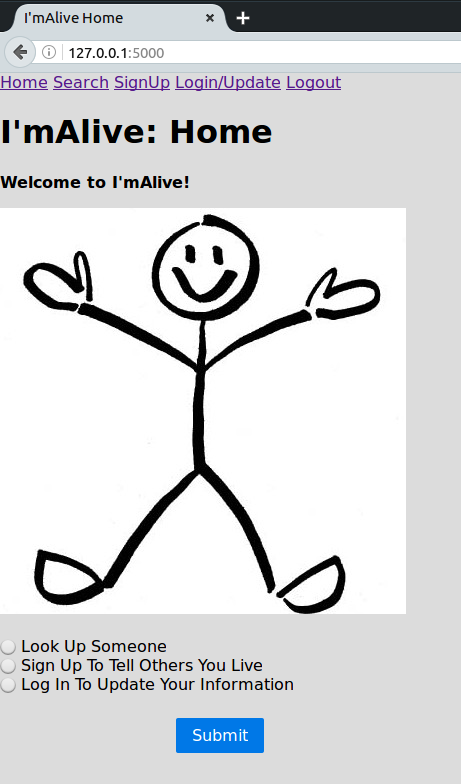
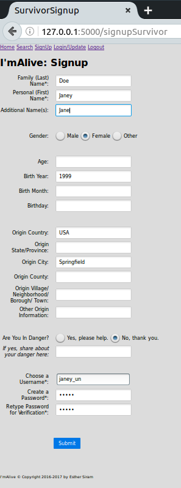
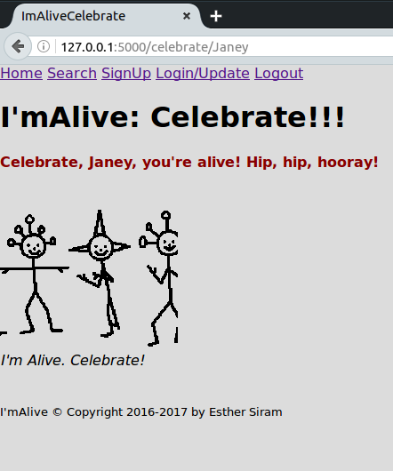
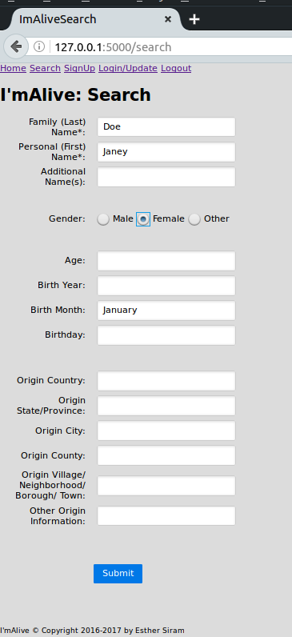
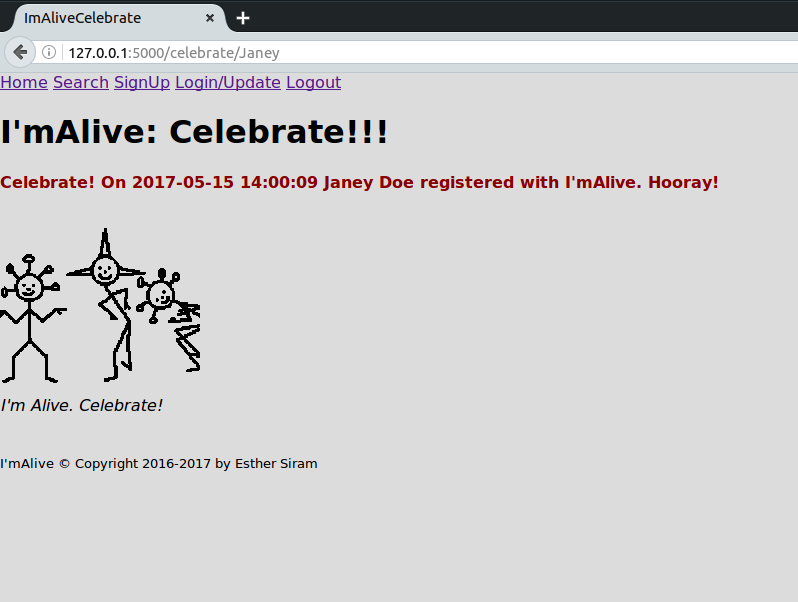

I'mAlive
==========

I'mAlive is a prototype Python Flask CRUD web app for refugees and/or human trafficking victims to tell their families that they still live.

Motivation
----------
Many people lack access to more common social media platforms and/or, who due to safety issues, cannot share much identifying information about themselves online but want to let their families know that they live.  Such folks inspired the creation of I'mAlive.  I chose Flask, Python, and SQLite at the advice of professional programmers encouraging me to learn how to code and to use programming in pursuit of practically helping vulnerable people get out of harmful situations and into good ones.

Installation
------------
First install [Python 3][1], then [SQLite][2], and then [Flask][3], then do:

    > git clone https://github.com/esiram/imalive.git
    > cd imalive
    > export FLASK_APP=imalive
    > export FLASK_DEBUG=true
    > flask run

The 'imAlive' app should now be running on `http://127.0.0.1:5000`.

Usage
-----
I'mAlive's users include *survivors*, *seekers*, and *administrators*.

On the *Home* screen survivors and administrators choose to sign up a survivor with I'mAlive or to update a survivor's information.  Seekers opt to look up individual survivors.

To create an I'mAlive profile, a survivor clicks the *Home* screen's "Sign Up To Tell Others You Live" button or clicks the "SignUp" navigation link.  This sends the survivor to the *SignUp* screen.  There the survivor registers with I'mAlive by submitting a password, a unique username, a family (last) name, and a personal (first) name; the survivor can share other data too, but I'mAlive doesn't require it.

If survivors currently live in dangerous situations, they may communicate this via I'mAlive by answering the "Are You In Danger?" question with "Yes, please help." If possible, the survivor will hopefully give more details about the danger.  I'mAlive administrators could then share this so-called *SOS* data with the appropriate government and/or nonprofit agency(ies) which could then try to aid the survivors.

Examples of vulnerable survivors include: starving refugees, human trafficking victims, and victims of domestic violence.

Once survivors submit their signup data, I'mAlive sends them to a personalized *Celebrate* screen.

To update their information, survivors click the *Home* screen's "Log In To Update Your Information" button or click on the "Login/Update" navigation link.  Survivors must log in with their passwords and unique usernames.  If successfully logged in, I'mAlive sends the survivor to the *Update* screen which shows the survivor's current I'mAlive profile information next to the fields that the survivor may change.

Seekers click the *Home* screen's "Look Up Someone" button or click on the "Search" navigation link.  This sends seekers to the *Search* screen where seekers may input survivors' family and personal names to look for specific individuals.  Seekers may submit other details in the *Search* screen, but in order to find the right survivor, any other data must match what the survivor provided at registration and/or when updating the survivor's I'mAlive record.

If the seeker's survivor data matches a survivor's data in I'mAlive's database, I'mAlive sends the seeker to a *Celebrate* screen which tells when the survivor registered with I'mAlive, but doesn't give any other locating information for the survivor's safety.

At this time, administrators can update the database only in a backend, development sense.  If launched for "real world" use, I'mAlive administrators would have the ability to take the SOS information and contact the appropriate agencies to help survivors.  Also, I'mAlive administrators could potentially update survivor or help survivors update their I'mAlive profiles.  What type of survivor information administrators could access depends on how I'mAlive rolls out and would need thoughtful review by the appropriate authorities to ensure each survivors' safety.

   [1]: https://www.python.org/
   [2]: https://sqlite.org/
   [3]: http://flask.pocoo.org/

 

