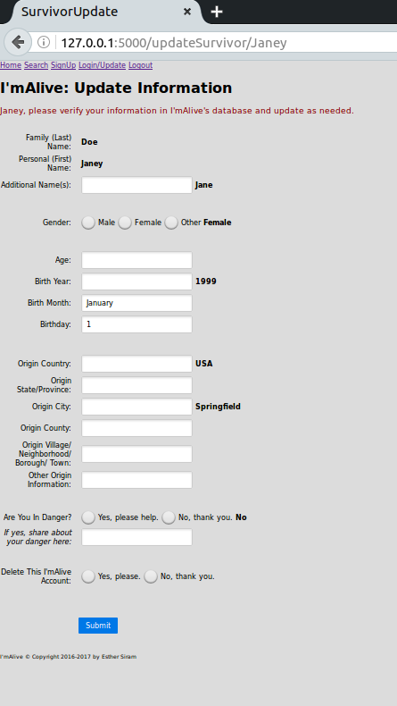

I'mAlive
==========

I'mAlive is a prototype Python Flask CRUD web app for refugees and/or human trafficking victims to tell their families that they still live.

Motivation
----------
Many people lack access to more common social media platforms and/or, who due to safety issues, cannot share much identifying information about themselves online but want to let their families know that they live.  Such folks inspired the creation of I'mAlive.  I chose Flask, Python, and SQLite at the advice of professional programmers encouraging me to learn how to code and to use programming in pursuit of practically helping vulnerable people get out of harmful situations and into good ones.

Installation
------------
First install [Python 3][1], then [SQLite][2], and then [Flask][3], then do:

    > git clone https://github.com/esiram/imalive.git
    > cd imalive
    > export FLASK_APP=imalive
    > export FLASK_DEBUG=true
    > flask run

The 'imAlive' app should now be running on `http://127.0.0.1:5000`.

Usage
-----
I'mAlive's users include *survivors*, *seekers*, and *administrators*.

On the home page survivors and administrators choose to signup a survivor with I'mAlive or to update information.  Seekers opt to look up individual survivors.

A survivor registers with I'mAlive by submitting a password, a unique username, a family (last) name, and a personal (first) name; the survivor can share other data too, but I'mAlive doesn't require it.

If survivors currently live in dangerous situations, they may communicate this via I'mAlive. I'mAlive administrators could then share this so-called *SOS* data with the appropriate government and/or nonprofit agency(ies) which could then try to aid the survivors.

Examples of vulnerable survivors include: starving refugees, human trafficking victims, and victims of domestic violence.

When registered, I'mAlive celebrates with the survivor.

To update their information, survivors must log in with their passwords and unique usernames.  The update page shows the survivor's current I'mAlive profile.

Seekers input a survivor's family and personal name in the I'mAlive search page to look for a specific individual.  Seekers may submit other details in the search screen, but in order to find the right survivor, the other details must match what the survivor provided at signup and/or when updating the survivor's I'mAlive record.

If found, I'mAlive sends the seeker to a celebrate screen which tells when the survivor registered with I'mAlive, but doesn't give any other locating information for the survivor's safety.

At this time, administrators can update the database only in a backend, development sense.  If launched for "real world" use, I'mAlive administrators would have the ability to take the SOS information and contact the appropriate agencies to help survivors.  Also, I'mAlive administrators could potentially update survivor or help survivors update their I'mAlive profiles.  What type of survivor information administrators could access depends on how I'mAlive rolls out and would need thoughtful review by the appropriate authorities to ensure each survivors' safety.

   [1]: https://www.python.org/
   [2]: https://sqlite.org/
   [3]: http://flask.pocoo.org/

 

